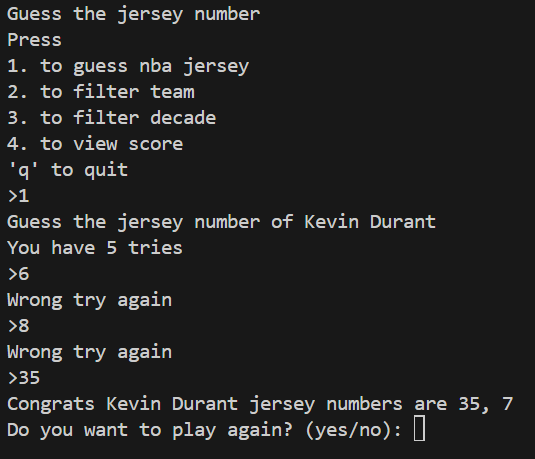

# Guess the NBA Jersey Number

## A simple Python game where the user guesses the jersey number of random NBA players.

This project is fun and simple way to guess nba jersey base on the NBA player name. 

## Features
- The game has a filter option for team and decade.
- You can also play the game without the filter options.
- Users can also view the score and quit within the loop with q.
- Json file to store player database.

## Future improvements
- I want to make this fun game release in web to make it easier to access and share with people.
